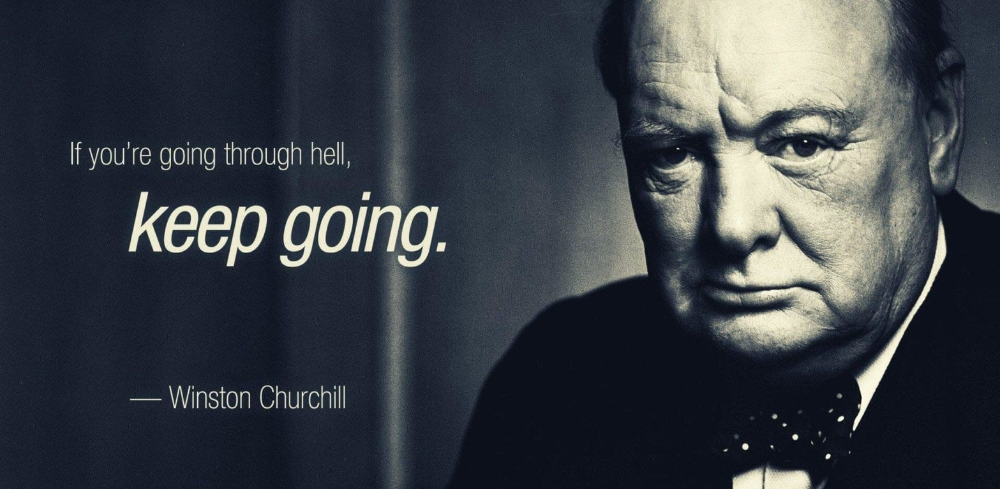

Hi! Tere!

Welcome to my page! I am Roland Shum, a developer studying in Estonia. I am not really a tech-nerd but sometimes I do when I am so into my work.
I built this site to share what I have learnt, my thoughts, and my stories with happiness, hardness, madness and sadness.
Hope you will enjoy!

Email: rolandshum.shc@gmail.com

### Background

Specialized in web & mobile development

Interested research topics - Machine Learning, Gaming AI

Born in HK, Raised in HK, Studied in HK, UK, Israel, and Estonia.

A Hongkonger, a die hard fan of #arsenal.

### Hobby

NERDY: Gaming, Wikipedia, Code

NOT NERDY: Travelling, Swimming, Ping-pong, Photography

### latest studies

1. React Native prototyping for an Estonian startup company

2. Completing an Udemy course about Agile, SCRUM, KANBAN

Life is always not easy.

Be open to new ideas and, keep calm and carry on 😉

Try to publish new post biweekly and see ya!