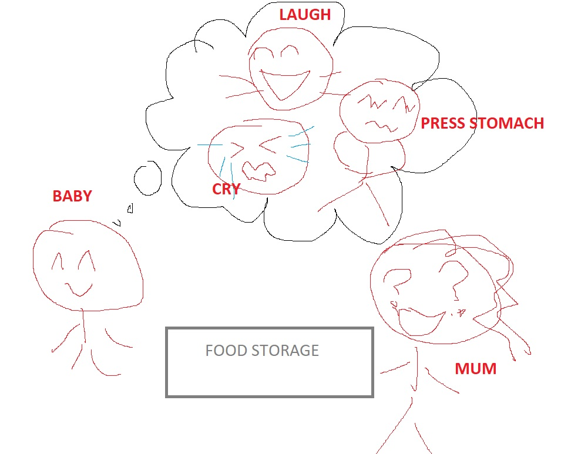

### Background

Related course - Mobile and Cloud Computing Seminor.
It was a research of different reinforcement learning frameworks in cloud resource management.
Due to covid-19 most of the readings and research works were done remotely.
Nevertheless, it was fun and worth to learn this old but not obsolete concept!

------------------------------

### What is RL?

So what is Reinforcement Learning(RL)?

definition:

It is an intelligent agent model with online learning through interacting with the environment by taking certain actions based on rewards considerations.
An online learning means the agent is learning while trying.

In this article, I try not to include any mathematical formulas but introduce some conceptual basics.

To make it easier to understand, we now simply define some definitions for a RL model as  an example as below.

Agent: a baby

Environment: baby's mum

Action lists: crying, laughing, pressing stomach

Rewards: food

So here is our problem, how does the baby in the above scenario get the food?

As a baby who still could not say hungry, it has 3 kinds of action to choose from

1. crying

2. smiling

3. pressing stomach

Now the question is that what would it choose to do first?

When it doesn't know anything, it would try, try different actions randomly. 
Since the baby has no infomration about the 3 actions, then the expectation value of each action should be the same at initial.

This is the exploration process of reinforcement learning - to try actions randomly and see what will happen.

Let's say the following scenario:

------------------------------

1)  baby laughs, then no food

2) baby cries, then no food

3) baby presses stomach, then mum gives food

------------------------------

Then the reward the baby gets from her action-laugh is nothing but her mum's laughing.

Here, the baby learns, it will remember that laughing seems not working to show her hunger.

In a RL model, we would want to update the expectation value of the action - laughing
so that this action would be less preferable in the future.

After trying different actions, their expectation values would be updated.

Here we may want to know

what if the baby looks weak / tired?

What if her mum is busy with other things?

There are many other temporary factors which would probably affect the results of different actions.
Surely, it is good to add them to the model.

In next chapter, I will introduce the concept of "STATE".

Will add the next article link here "Reinforcement Learning 2"

Recommended reading:

 <a href="https://www.geeksforgeeks.org/what-is-reinforcement-learning/">geeksforgeeks - Reinforcement learning</a>

Last edited: 16/07/2020

---

